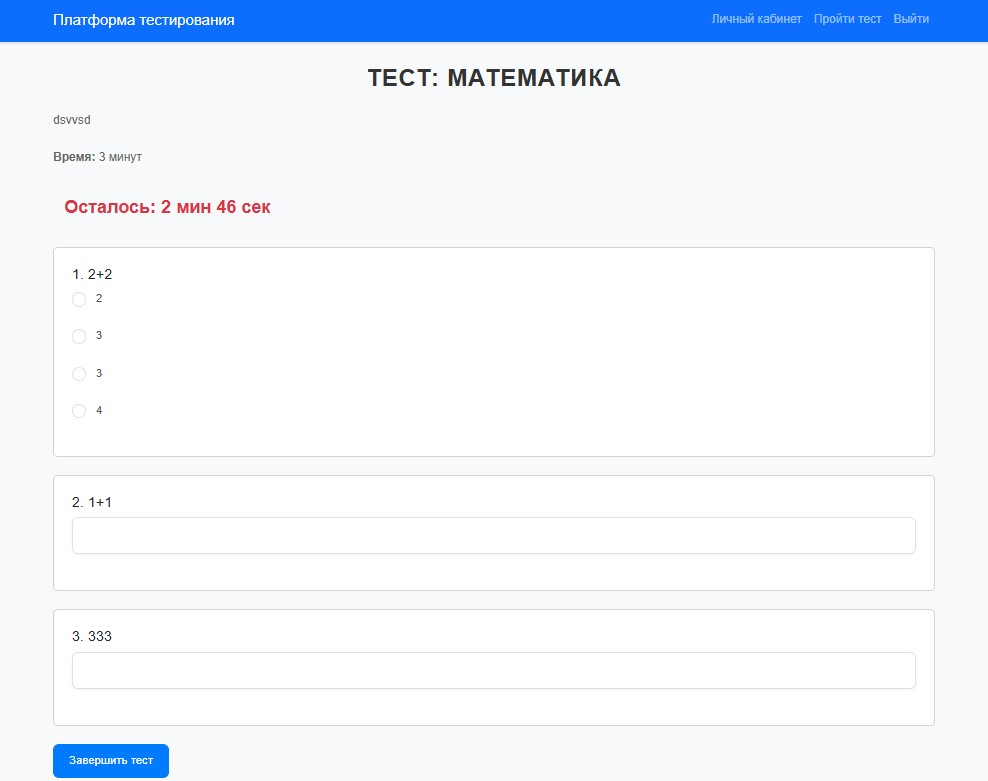
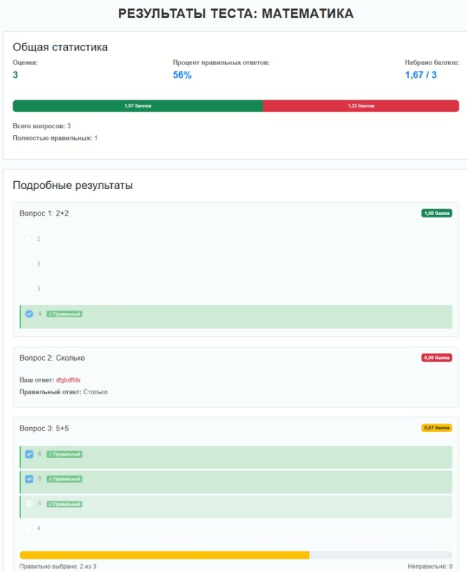
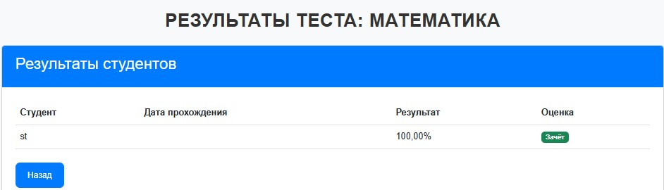
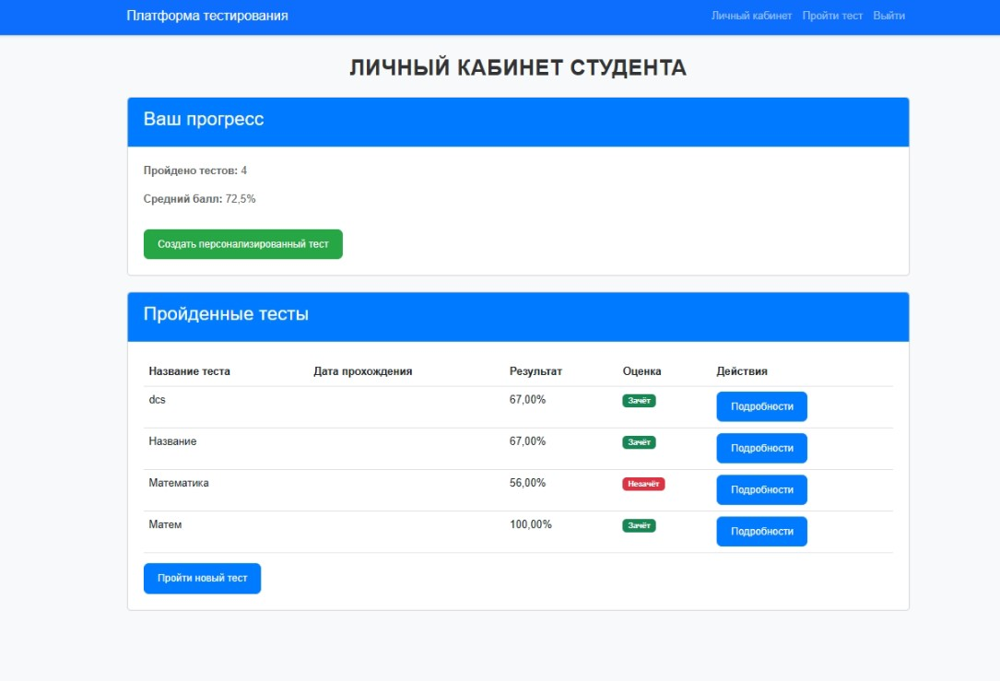

# Онлайн-платформа для тестирования знаний студентов

Веб-приложение для преподавателей и студентов, позволяющее создавать тесты, проходить их по уникальному коду, автоматически проверять ответы и получать детализированные результаты.

Проект разработан в рамках личного портфолио.

## Основные возможности

- Регистрация и авторизация (роли: студент / преподаватель)
- Создание тестов преподавателем:
  - разные типы вопросов (множественный выбор, один правильный, текстовый ответ)
  - загрузка изображений к вопросам
  - настройка времени выполнения
  - гибкая система оценивания (дифференцированная / недифференцированная, настраиваемые пороги)
- Прохождение теста студентом по уникальному коду
- Автоматическая проверка ответов 
- Генерация персонализированных тестов на основе предыдущих ошибок
- Просмотр результатов и статистики 
- Управление активностью тестов 
- Адаптивный и минималистичный интерфейс

## Технологический стек

 Backend: Python 3.10+, Django 5.0+
 База данных: SQLite / PostgreSQL 
 Frontend: HTML5, CSS3, JavaScript
 Работа с изображениями: Pillow
 Формы и стилизация: django-crispy-forms 

## 1. Установка и запуск 

```bash
# 1. Клонируем репозиторий
git clone https://github.com/Maksim-73/Testing-platform-django-.git
cd Testing-platform-django
```

## 2. Создаём и активируем виртуальное окружение
```bash
python -m venv venv
source venv/bin/activate    # Linux / macOS
venv\Scripts\activate       # Windows
```

## 3. Устанавливаем зависимости
```bash
pip install -r requirements.txt
```

## 4. Применяем миграции
```bash
python manage.py migrate
```

## 5. Создаём суперпользователя (преподавателя)
```bash
python manage.py createsuperuser
```

## 6. Запускаем сервер
```bash
python manage.py runserver
```

## Скриншоты

### Главная страница


### Создание теста 


### Прохождение теста 


### Завершение и результаты теста 


### Статистика по студентам, прошедшим тест


### Личный кабинет студента 


### Личный кабинет преподавателя

